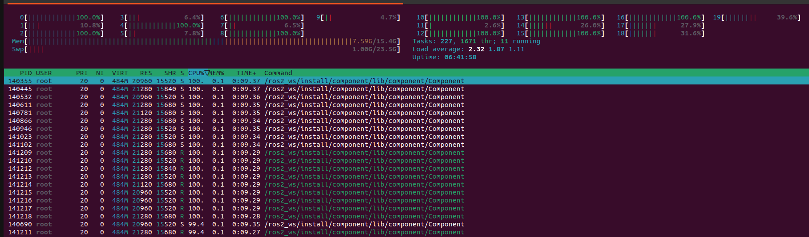
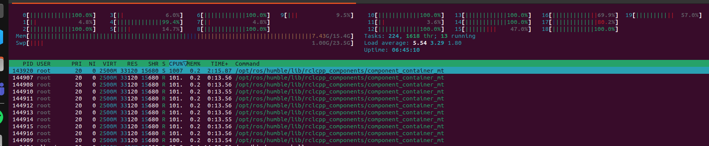
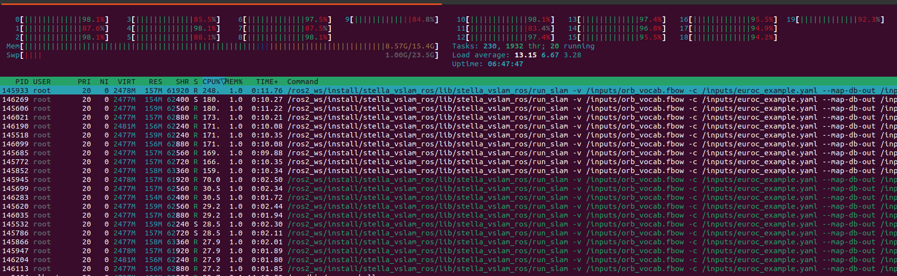
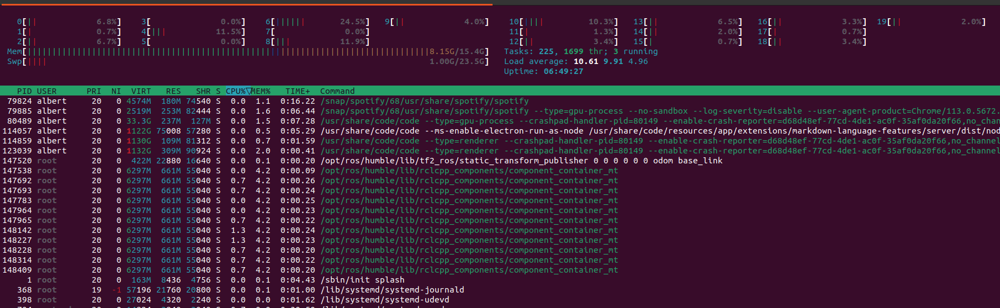
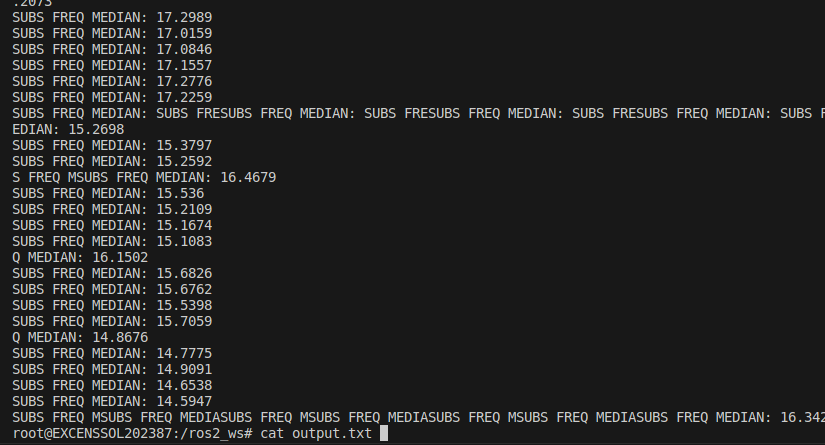
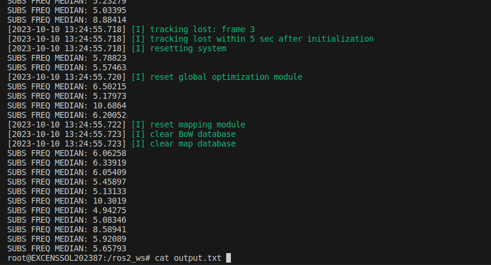

# rclcpp_max_consumption
Project with two dockers:
1. A docker that creates a simple process (simple process docker) in ros2 that consumes a lot of CPU. This process can be loaded as a single process as many times as requested and can also be loaded as a rclcpp_component.
2. A docker that does the same but using stella_vslam repo (stella_vslam components docker) to test the performance of multiple stella_vslam processes/components running at the same time.

## Installation simple process docker
Build dockers using:
`./component_docker/build_docker.sh`

## Execution simple process docker
#### Execute multiple separated processes
`NUM_OF_PROCESSES` can be any number, the bash file will launch as many processes as specified.
`./component_docker/docker/run_processes.sh NUM_OF_PROCESSES`

#### Execute multiple processes as ros2 components
`NUM_OF_COMPONENTS` can be any number, the bash file will launch as many components as specified.
`./component_docker/docker/run_components.sh NUM_OF_COMPONENTS`

## Installation stella_vslam components docker
Clone the submodules using: `git submodule update --recursive -i`

Build dockers using:
`./component_stella_docker/build_stella_docker.sh`
`./component_stella_docker/build_stella_rosbag.sh`

Download rosbag euroc from: [url](https://projects.asl.ethz.ch/datasets/doku.php?id=kmavvisualinertialdatasetshttps://projects.asl.ethz.ch/datasets/doku.php?id=kmavvisualinertialdataset)

Transform ROS1 rosbag to ROS2 rosbag using python rosbags-convert like: `rosbags-convert /EuRoC/MH_04_difficult.bag ./MH_04_difficul`

Save the converted rosbag folder into `./component_stella_docker/inputs` and modify bash file `start_stella_vslam-rosbag.sh` with your rosbag folder name.

## Execution stella_vslam components docker
#### Execute multiple stella_vslam_ros processes
`NUM_OF_PROCESSES` can be any number, the bash file will launch as many processes as specified.
`./component_stella_docker/docker/run_processes.sh NUM_OF_PROCESSES`

#### Execute multiple processes as ros2 components
`NUM_OF_COMPONENTS` can be any number, the bash file will launch as many components as specified.
`./component_stella_docker/docker/run_components.sh NUM_OF_COMPONENTS`

Going inside the docker in /ros2_ws/out.txt there's the console output where the frequency in which an image enters to the callback.

## htop screenshots obtained

### 10 simple high cpu ros2 nodes (separated processes)

### 10 simple high cpu ros2 components

### 10 stella_vslam_ros nodes (separated processes) euroc dataser MH_01_easy

### 10 stella_vslam_ros components euroc dataser MH_01_easy

### Imgs subs callback frequency of stella_vslam_ros nodes (executing 10 at the same time)

### Imgs subs callback frequency of stella_vslam_ros COMPONENTS (executing 10 at the same time)

